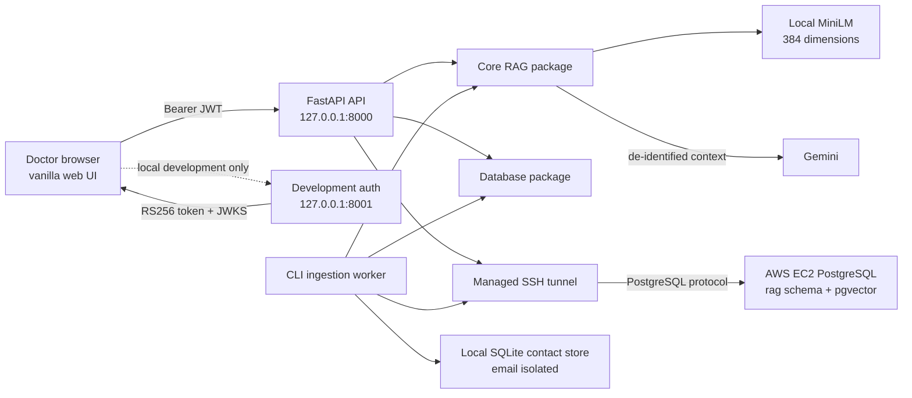

# Architecture

## Runtime boundaries

- `apps/api` owns HTTP routing, JWT enforcement, rate limiting, security headers, and static frontend delivery. It is stateless apart from the bounded in-process rate-limit window.
- `apps/worker` owns explicit CLI jobs. Indexing is not hidden in API startup, and no queue service is required.
- `apps/dev-auth` is a local testing identity provider. It listens on loopback, creates an in-memory key at startup, and loses all signing state when stopped.
- `apps/web` contains dependency-free browser assets. Tokens and transcripts stay in JavaScript memory.
- `packages/core-rag` owns clinical chunk construction, embeddings, retrieval fusion, generation, and guardrails. It uses a repository protocol so retrieval rules do not depend on PostgreSQL implementation details.
- `packages/db` owns PostgreSQL and SQLite access, SQL aggregation, migrations, pgvector operations, and the isolated contact store.
- `packages/common` owns configuration, hashing, SSH lifecycle, and Windows event-loop setup shared by apps and packages.

## Clinical data path

The worker opens an SSH tunnel to the EC2 host, reads the approved columns from `public.clinical_records`, aggregates facts in SQL, chunks them with the pinned MiniLM tokenizer, embeds them locally, and writes to the existing `rag` schema. Email is copied only into the separate SQLite contact table and is removed from clinical text.

For a query, the API validates the JWT and verifies that the selected patient appears in its `patient_ids` claim. PostgreSQL dense and full-text branches both receive the same patient parameter. Weighted reciprocal-rank fusion and MMR select context. Patient IDs, admission IDs, email, JWT data, and doctor identity are removed before the context is sent to Gemini. NeMo and deterministic checks run around generation.

## Dependency direction

`apps` may depend on `packages`. `packages/db` may depend on `packages/core-rag` data models, while `packages/core-rag` depends only on the repository protocol it defines. `packages/common` has no internal package dependency. This direction prevents the HTTP, database, and model layers from importing each other in a cycle.
